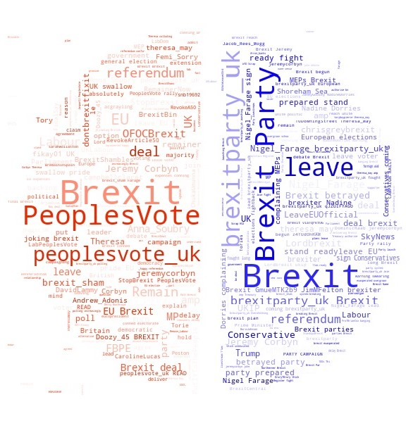

# Brexit-Project

  

 
Codes and visualizations for the project focusing on understanding how political attitude around Brexit changed on UK Twittersphere. Mostly written in Python, with visualization compiled in a Jupyter Notebook.
  
A paper based on the project (entitled "Digital Political Discourse in the Countdown to Brexit") was submitted as the dissertation for partial fulfillment of the requirement for the MSc in Sociology at University of Oxford on August 28th 2019.
